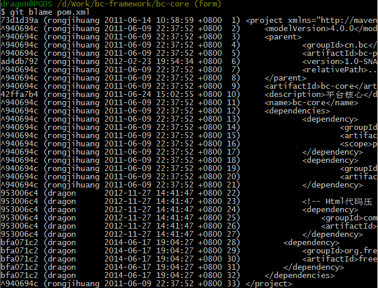
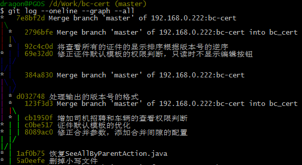
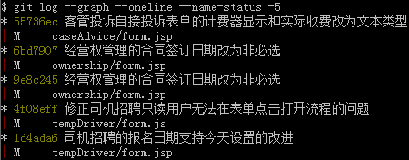
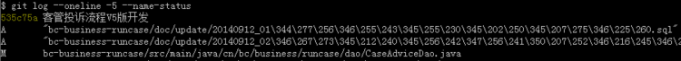
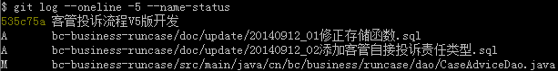

# Git 常用操作命令

date: 2010-12-25 18:32:46 

> Backup from <http://rongjih.blog.163.com/blog/static/335744612010112562833316/>

## 1. 远程仓库相关命令

检出仓库：$ git clone git://github.com/jquery/jquery.git  
检出仓库：$ git clone -o github -b 2.0.0 git://github.com/jquery/jquery.git jquery2  
> 直接检出分支 2.0.0，指定远程仓库名称为 github （默认为 origin）、检出到文件夹 jquery2 (默认为 jquery)

查看远程仓库：$ git remote -v  
添加远程仓库：$ git remote add $name $url]=  
删除远程仓库：$ git remote rm $name  
修改远程仓库：$ git remote set-url --push $name $newUrl  
拉取远程仓库：$ git pull $remoteName $localBranchName  
推送远程仓库：$ git push $remoteName $localBranchName  
强制推送更改：$ git push --force origin master

> 如果想把本地的某个分支 test 提交到远程仓库，并作为远程仓库的 master 分支，或者作为另外一个名叫 test 的分支，如下：  
> $ git push origin test:master // 提交本地 test 分支作为远程的 master 分支  
> $ git push origin test:test   // 提交本地 test 分支作为远程的 test 分支

## 2. 分支(branch)操作相关命令

查看本地分支：$ git branch  
查看远程分支：$ git branch -r （如果还是看不到就先 git fetch origin）  
创建本地分支：$ git branch $name <--注意新分支创建后不会自动切换为当前分支  
切换分支：$ git checkout $name  
创建新分支并立即切换到新分支：$ git checkout -b $name  
直接检出远程分支：$ git checkout -b $name $remoteName (如：git checkout -b myNewBranch origin/dragon)  
删除分支：$ git branch -d $name <-- -d 选项只能删除已经参与了合并的分支，对于未有合并的分支是无法删除的。如果想强制删除一个分支，可以使用 -D 选项  
合并分支：$ git merge $name <--将名称为 $name 的分支与当前分支合并  
合并最后的2个提交：$ git rebase -i HEAD~2 <-- 数字 2 按需修改即可（如果需提交到远端$ git push -f origin master 慎用！）  
创建远程分支(本地分支 push 到远程)：$ git push origin $name  
删除远程分支：$ git push origin :heads/$name 或 $ git push origin :$name  
修改本地分支名称：git branch -m $old_branch_name $new_branch_name  
直接修改远程分支名称(不修改本地的)：git push $remote $remote/$old_name:refs/heads/$new_name :$old_name  
修改本地及其远程分支的名称：  
    1. git branch -m $old_name $new_name  
    2. git push $remote --set-upstream new_name  
    3. git push $remote :$old_name  
    对于其它客户端的仓库，需要执行如下两个命令获取最新的修改：  
    4. git fetch $remote  
    5. git remote prune $remote

**创建空的分支**：(执行命令之前记得先提交你当前分支的修改，否则会被强制删干净没得后悔)

> 方法1：  
> $ git checkout --orphan $branch_name  
> $ git rm -rf *  
> 
> 方法2：  
> $ git symbolic-ref HEAD refs/heads/$name  
> $ rm .git/index  
> $ git clean -fdx  

## 3. 版本(tag)操作相关命令

查看版本：$ git tag  
创建版本：$ git tag $name  
删除版本：$ git tag -d $name  
查看远程版本：$ git tag -r  
创建远程版本(本地版本push到远程)：$ git push origin $name  
删除远程版本：$ git push origin :refs/tags/$name  
合并远程仓库的tag到本地：$ git pull origin --tags  
上传本地tag到远程仓库：$ git push origin --tags  
创建带注释的tag：$ git tag -a $name -m 'yourMessage'  

## 4. 子模块(submodule)相关操作命令

添加子模块：$ git submodule add [url] [path]  
> 如：$ git submodule add git://github.com/soberh/ui-libs.git src/main/webapp/ui-libs

初始化子模块：$ git submodule init <--只在首次检出仓库时运行一次就行  
更新子模块：$ git submodule update <--每次更新或切换分支后都需要运行一下  
删除子模块：（分4步走哦）  
1. $ git rm --cached [path]
2. 编辑 `.gitmodules` 文件，将子模块的相关配置节点删除掉
3. 编辑 `.git/config` 文件，将子模块的相关配置节点删除掉
4. 手动删除子模块残留的目录

## 5. 忽略一些文件、文件夹不提交

在仓库根目录下创建名称为 `.gitignore` 的文件，写入不需要的文件夹名或文件，每个元素占一行即可，如：

```
target
bin
*.db
```

## 6. 后悔药

删除当前仓库内未受版本管理的文件：$ git clean -f  
恢复仓库到上一次的提交状态：$ git reset --hard  
回退所有内容到上一个版本：$ git reset HEAD^  
回退 a.py 这个文件的版本到上一个版本：$ git reset HEAD^ a.py  
回退到某个版本：$ git reset 057d   
将本地的状态回退到和远程的一样：$ git reset –hard origin/master    
向前回退到第 3 个版本：$ git reset –soft HEAD~3  
修改最后的提交日志：$ git commit --amend  
修改最后的提交日期为当前时间：$ git commit --amend  --date="$(date -R)"  

## 7. Git一键推送多个远程仓库

编辑本地仓库的 `.git/config` 文件：

```
[remote "all"]
  url = git@github.com:dragon/test.git
  url = git@gitcafe.com:dragon/test.git
```

这样，使用 `git push all` 即可一键 push 到多个远程仓库中。

## 8. 缓存认证信息

```
$ git config credential.helper cache
```

## 9. 查看提交日志

### 查看文件中的每一行的作者、最新的变更提交和提交时间

```
$ git blame $fileName
```



### 查看仓库历史记录

有三个应该知道的选项：

- --oneline - 压缩模式，在每个提交的旁边显示经过精简的提交哈希码和提交信息，以一行显示。
- --graph - 图形模式，使用该选项会在输出的左边绘制一张基于文本格式的历史信息表示图。如果你查看的是单个分支的历史记录的话，该选项无效。
- --all - 显示所有分支的历史记录

把这些选项组合起来之后如下：



使用 `$ git log --oneline --graph --name-status` 既可以看到简介的日志信息，也可以看到改了哪些文件，一举两得：



## 10. 有选择的合并 - 这个功能最赞，没有之一

`cherry-pick` 可以从不同的分支中捡出一个单独的 commit，并把它和你当前的分支合并。如果你以并行方式在处理两个或以上分支，你可能会发现一个在全部分支中都有的 bug。如果你在一个分支中解决了它，你可以使用 `cherry-pick` 命令把它 commit 到其它分支上去，而不会弄乱其他的文件或 commit。

```
$ git cherry-pick $commitHash
```

## 11. Stash 未提交的更改

正在修改某个 bug 或者某个特性，又突然被要求展示工作。而现在所做的工作还不足以提交，这个阶段还无法进行展示（不能回到更改之前）。在这种情况下，`git stash` 可以帮到忙了。stash 在本质上会取走所有的变更并存储它们以备将来使用。

```
$ git stash
```

检查 stash 列表：$ git stash list  
想解除 stash 并且恢复未提交的变更，就进行 apply stash：`$ git stash apply`  
如果只想留有余地进行 apply stash，给 apply 添加特定的标识符：`$ git stash apply stash@{0}`

## 12. 多次修改后拆分提交 - 暂存文件的部分改动

一般情况下，创建一个基于特性的提交是比较好的做法，意思是每次提交都必须代表一个新特性的产生或者是一个 bug 的修复。如果你修复了两个 bug，或是添加了多个新特性但是却没有提交这些变化会怎样呢？在这种情况下，你可以把这些变化放在一次提交中。但更好的方法是把文件暂存(Stage)然后分别提交。
例如你对一个文件进行了多次修改并且想把他们分别提交。这种情况下，可以在 add 命令中加上 -p 参数

```
$ git add -p $fileName
```

## 13. 压缩多个Commit

用 rebase 命令把多个 commit 压缩成一个：

```
$ git rebase -i HEAD~[number_of_commits]
```

如果想压缩最后两个 commit，运行下列命令：

```
$ git rebase -i HEAD~2
```

Docs: [7.6 Git 工具 - 重写历史](http://git-scm.com/book/zh/v2/Git-%E5%B7%A5%E5%85%B7-%E9%87%8D%E5%86%99%E5%8E%86%E5%8F%B2) 、[3.6 Git 分支 - 变基](http://git-scm.com/book/zh/v2/Git-%E5%88%86%E6%94%AF-%E5%8F%98%E5%9F%BA)

## 14. 差异查看

```
$ git diff --name-status HEAD~2 HEAD~3 <-- 获得两个版本间所有变更的文件列表
$ git diff HEAD HEAD~1 <-- 查看最近两个提交之间的差异
$ git diff HEAD HEAD~2 <-- 查看第1个与第3个提交之间的差异
^ - 代表父提交，^n 表示第n个父提交，^相当于^1 git寻根：^和~的区别 - 分析得很到位
~ - 代表连续的提交，~n相当于连续的第n个提交
$ git diff master..test <-- 比较两个分支之间的差异
$ git diff master...test <-- 比较master、test的共有父分支和 test 分支之间的差异
$ git diff test <-- 比较当前工作目录与 test 分支的差异
$ git diff HEAD <-- 比较当前工作目录与上次提交的差异
$ git diff HEAD -- ./lib  <-- 比较当前工作目录下的lib目录与上次提交的差异
$ git diff --stat  <-- 统计一下有哪些文件被改动，有多少行被改动
$ git diff --cached  <-- 查看下次提交时要提交的内容(staged,添加到索引中)
```

## 15. Git for Windows 中文乱码问题 (1.9.4-preview20140611)

> Git for Windows 从 1.7.9 版本开始支持使用中文文件、文件夹名称，结束了跨平台中文乱码的问题。

### git log 显示的文件名乱码：

执行 `git config –global core.quotepath false` 可以解决之。`core.quotepath` 设为 false，就不会对 0×80 以上的字符进行 quote，中文就显示正常。

修正前：



修正后：



### ls 命令显示的中文名乱码：

改用 `ls --show-control-chars` 命令代替单纯的 `ls` 命令即可。

或者编辑 `.../Git/etc/git-completion.bash`，新增一行 `alias ls="ls –show-control-chars"`

## 资料参考：

- [Git Submodule 的認識與正確使用！](http://josephjiang.com/entry.php?id=342)
- [如何保持在 Git Submodule 代码的开放和私有共存](http://icyleaf.com/2010/08/03/how-to-keep-public-and-private-versions-of-a-git-submodule-repo-in-sync/)
- [Git Submodule Tutorial](https://git.wiki.kernel.org/index.php/GitSubmoduleTutorial)
- [删除 git submodule ](http://blog.ossxp.com/2010/01/425/)
- [pages.github.com](http://pages.github.com/)
- [Git 获取远程分支](http://lfeng.me/2009/07/23/git-remote-branch-access/)
- [Git for Windows Unicode Support](https://github.com/msysgit/msysgit/wiki/Git-for-Windows-Unicode-Support)
- [Git 一键推送多个远程仓库](http://my.oschina.net/chinesedragon/blog/81483)
- [图解 Git](http://my.oschina.net/u/198088/blog/114383)
- [使用 git 合并多个提交](http://www.cnblogs.com/wujianlundao/archive/2012/07/30/2615873.html)
- [git: 多个commit合并提交](http://zn-moonlight-gmail-com.iteye.com/blog/1217841)
- [git rebase \(本地分支合并)](http://www.cnblogs.com/kym/archive/2010/08/12/1797937.html) / [git rebase \(本地与远程同步)](http://ihower.tw/blog/archives/3843)
- [git merge 和 git rebase](http://blog.csdn.net/nebulali/article/details/7682813)
- [版本控制系統 Git 精要](http://ihower.tw/git/)
- [10 个很有用的高级 Git 命令](http://www.oschina.net/translate/10-useful-advanced-git-commands)
- [git 修改历史提交](http://yuxu9710108.blog.163.com/blog/static/237515342011910113822476/)
- [10 个迅速提升你 Git 水平的提示](http://www.oschina.net/translate/10-tips-git-next-level)
- [git寻根：^ 和 ~ 的区别 - 分析得很到位](http://www.cnblogs.com/hutaoer/archive/2013/05/14/3078191.html)
- [比较提交 - Git Diff](http://gitbook.liuhui998.com/3_5.html)
- [怎么删除不想要的 commit 历史](http://www.zhihu.com/question/22132675)
- [Git 官方文档：重写历史](https://git-scm.com/book/zh/v1/Git-%E5%B7%A5%E5%85%B7-%E9%87%8D%E5%86%99%E5%8E%86%E5%8F%B2)
- [批量删除 git 分支](http://www.jianshu.com/p/3602f666799a)