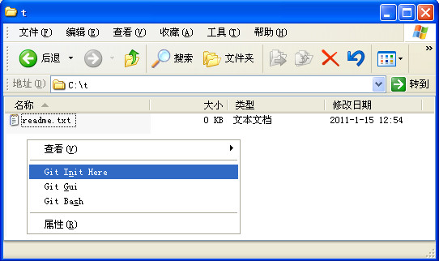
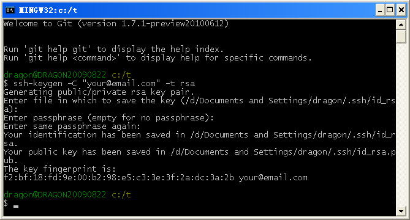
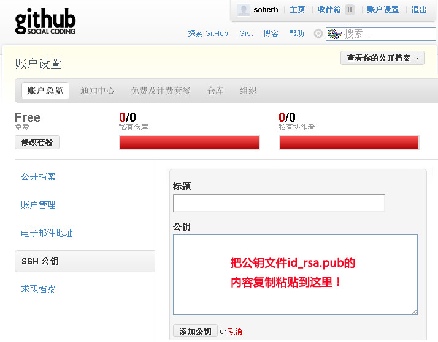
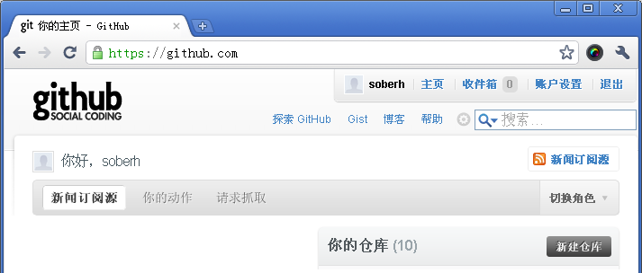

# 基于互联网的 Git 开发环境搭建 (Windows 系统)

date: 2011-01-15 15:09:36

> Backup from <http://rongjih.blog.163.com/blog/static/33574461201101504819691/>

使用 git 进行版本管理已有很长一段时间，git 的分布式大大提高了代码的管理效率。在此总结一下在 Windows 环境下如何从零开始搭建一个基于互联网协作开发的 git 版本管理环境，相关的工具包括 msysgit、tortoisegit、github.com，详细步骤如下：

## 1. 安装 Git for Windows

Git 原身是 linux 下的一个版本管理系统，`Git for Windows` 就是专门为了在 windows 下使用而开发的，这是一个开源项目，安装包可以到 <http://code.google.com/p/msysgit/downloads/list> 下载，下载列表中有好几种类型的安装包，如果仅仅是为了使用 git，只需下载安装 `Git-{version}.exe` 即可。

安装过程使用默认配置一路 next 基本上都没问题。安装成功后，在任一文件夹的空白地方点击鼠标右键，可以看到Git常用的几个菜单（在开始菜单中也会有相应的选项），如下图所示：



- Git Init Here - 将当前目录初始化为 git 管理的目录，执行后会在当前目录下生成一个 `.git` 的目录。
- Git Gui       - 打开 git 的 GUI 工具，在这个工具里面可以基于图形界面操作 git 仓库，不喜欢命令行的可以用这个简单的 GUI 工具代替。
- Git Bash      - 打开 git 的命令行窗口，使用命令行方式操作 git 仓库。
    
> 验证安装是否成功：通过鼠标右键菜单中的 `Git Bash` 打开 Git 的命令行窗口，输入 `$ git --version`，如果输出类似 `git version 1.7.1.msysgit.0` 的版本信息，就安装成功了。

## 2. 申请一个 email 帐号

以下假设你申请的 email 帐号为 `your@email.com`。

## 3. 生成 Git 要使用的 ssh key

打开 Git 的命令行窗口，输入 `$ ssh-keygen -C "your@email.com" -t rsa`，按提示输入相关信息生成 rsa key（注意 email 地址修改为上面第 2 步中使用的）；默认会在当前登录用户的用户目录下创建名为 `.ssh` 的目录，并在该目录下生成两个文件，`id_rsa.pub` 和 `id_rsa`，一个是公钥另一个是私钥。命令行运行的截图参考如下：



如果不想使用密码，可以直接回车；不过还是建议使用密码，保险加安全，不用担心别人从你的 pc 偷走你的 key。

如果设置了密码，后来又不想要密码或者修改密码，运行类似如下的命令即可：

```
$ ssh-keygen -f '/d/Documents and Settings/dragon/.ssh/id_rsa' -p
```

根据提示输入原来的密码和设置新的密码即可。

## 4. 配置 git 全局使用的用户名和 email 帐号

设置全局用户名：`$ git config --global user.name "Your Name Here"`  
设置全局 email 帐号：`$ git config --global user.email your@email.com`

> 用户名可以随便按爱好取，email 帐号就用上面用的。  

## 5. 到 [github.com](https://github.com) 网站申请一个免费的帐号

github.com 可以免费保存、管理你的开源 git 项目，当然也提供付费服务，还有一个很大的好处，可以免费在上面建立自己的 blog 网站（应该说是任何的基于静态内容的网站），这里假设你申请的帐号使用的 email 地址为 `your@email.com`。

将第 3 步生成的公钥 `id_rsa.pub` 绑定到你的 github 帐号中，参考如下截图的说明即可：



通过上述配置后，你就可以向 github 上的仓库提交更改了。

## 6. 在 github 上创建一个仓库试一下

用你注册的帐号登录 github，导航到 github 的主页，点击页面中的 "新建仓库"，按提示创建一个新的仓库，这里假设该仓库的访问地址为 `git@github.com:yourname/test.git`。


 
在本机计算机上新建一个目录 test，进入该目录，空白处点鼠标右键，执行 `Git bash` 进入该目录的命令行窗口，执行如下命令：

```
$ git init
```

在该目录下新建 `readme.txt` 文件，随便写点东西进去（注意如果包含中文，必须将 readme.txt 文件保存为 UTF-8 格式），命令行运行如下命令：

```
$ git add readme.txt  <-- 将文件添加到 git 仓库管理
$ git commit -m testComment <-- 将修改提交到本地 git 仓库
$ git remote add origin git@github.com:yourname/test.git <-- 关联远程仓库到本地仓库
$ git pull origin master <-- 将远程仓库的内容更新到本地仓库的 master 分支
$ git push origin master <-- 将本地仓库 master 分支的所有更改同步到远程仓库
```

注：

1. 如果上面你的 ssh key 设置了密码，pull 和 push 命令会要求你输入密码。命令成功后，到你的 github 网站打开 test 仓库看看，readme.txt 已经同步上去了。
2. 在命令行下 `git commit` 命令最好不要用中文，否则 github 上看到的是乱码，如果需要中文，就用 `Git GUI` 工具，该工具支持中文信息的查看和提交。也可以使用 TortoiseGit 工具，这个就要另外下载安装了，操作起来类似于 TortoiseSVN。


## 参考资料：

- [Git 常用命令](./2010-12-25-Git常用操作命令.md)
- 生成 SSH Key：<http://help.github.com/msysgit-key-setup>
- 中文 git 教程：<http://progit.org/book/zh>