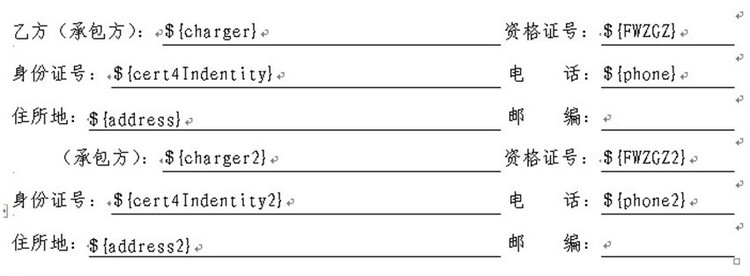
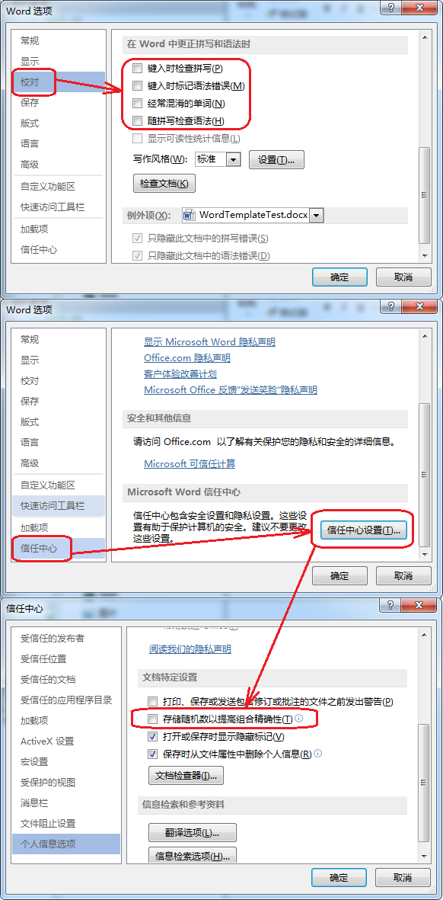
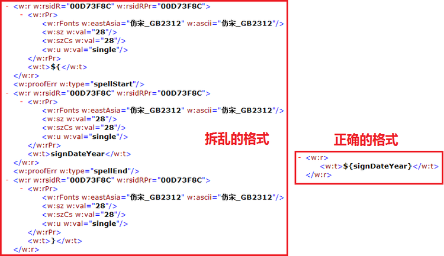

# 关于 Word 文档模板的制作

date: 2012-08-07 10:26:29

> Backup from <http://rongjih.blog.163.com/blog/static/335744612012779373096>

（BC 内部开发文档资料）

Word 文档的读写是用了 POI 组件，由于技术上的原因所致，现时只支持 docx 格式的文档占位符格式化，占位符使用 FreeMarker 格式，可以使用大部分的 FreeMarker 语法，但不支持循环迭代生成复杂的 Word 文档格式。因为执行格式化时，我们是对每一个占位符独立使用 FreeMarker 执行格式化处理操作的。总的来说使用简单的 "${...}" 格式就没错了，基本上 "..." 可以使用任何 FreeMarker 支持的语法。

如下的诸多限制基本上都是针对使用 MicrosoftOffice 制作 docx 模板、服务器用 OpenOffice 的文档转换服务转换为 pdf 后在线预览而言的。只要是因为 OpenOffice 转换 docx 为 pdf 后并不能保证格式 100% 的正确。为了尽量保证转换后不走样，遵循下面的在实践中总结出来的一些特别处理方式，能够提供比较好的转换效果。

## 1. 文档格式

Word 文档只能使用 docx 格式，即需要至少使用 Office 2007 版或以上的版本制作。

## 2. 占位符

完整的占位符应该由 `"${" + "参数名" + "}"` 组成，如 `${code}`、`${myMap.key1}`、`${myDate?string("yyyy-MM-dd HH:mm:ss")}`，占位参数只能由全英文或者英文加数字组成，务必不要使用中文！

## 3. 排版控制

### 3.1. 文字下横线的控制

如果能确定占位符实际内容的的长度，使用标准的 Word 下划线方法不会出现任何问题。但是如果占位符实际内容的长度未知，又想保持占位符替换后文字的下横线长度不变，则必须把占位符放在单行表格中，使用表格底部的边框线作为下划线，隐藏表格的其它边框线。这是实践证明出来的效果很好的方式。

### 3.2. 表格固定列宽的排版控制

在一个带有多占位符、多行、多列的表格中，如它的列宽宽度不相同，会出现替换后表格排版错乱的问题，解决方法是将此表格中每一行拆分为独立的一个表格，然后将这些表格间的段落行距设为最小值。参考下图：

 
### 3.3. 表格内嵌套表格或复杂的单元格合并问题

非常遗憾的是用 OpenOffice 转换后，嵌套表格或者复杂的单元格合并会导致布局完全一团糟，暂时没找到解决方法，期待 OpenOffice 新版能够修正好吧。

## 4. 备注

使用 Office2007 编辑文档时，`${...}` 保存正常；用更高版本的 Office 保存时，会导致 key 被分拆为 `${`、`key`、`}` 几部分，使文档无法被正确格式化。若要避免更高版本的 Office 保存时的这个问题，需要去除选项设置中校对的拼写检查相关项和个人信息选项中的 "存储随机数以提高组合精确性"，如 Office2013：

设置前后的格式对比图如下：(X.docx\word\document.xml)

> 2019-05-23 更新：更新版本的 Office 设置请看 《[Word 设置指引（BC系统Word模板文件需要此设置）](./2019-01-01-bc-Word设置指引(BC系统Word模板文件需要此设置).md)》