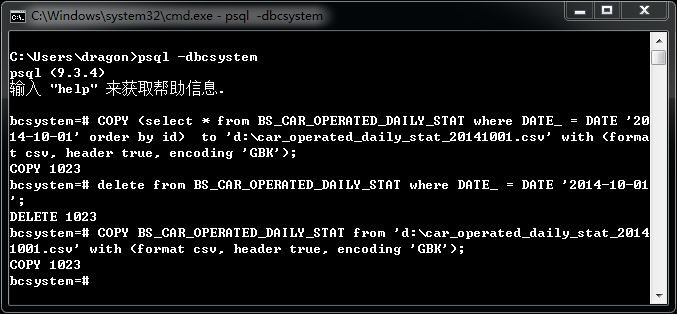

# Postgres 数据表部分数据的备份与恢复

date: 2014-11-17 10:22:44

> Backup from <http://rongjih.blog.163.com/blog/static/335744612014101710201222>

官方文档：<http://www.postgresql.org/docs/9.3/static/sql-copy.html>

步骤:

1. 命令行以超级用户登录数据库 bcsystem
    ```
    > psql -d bcsystem
    ```
2. 执行 `copy...to...` 命令备份数据到 csv 文件
    ```
    bcsystem=# copy (select * from bs_car_operated_daily_stat where date_ = date '2014-10-01' order by id)	to 'd:\car_operated_daily_stat_20141001.csv' with (format csv, header true, encoding 'gbk');
    ```

3. 执行 `copy..from...` 命令从 csv 文件恢复备份的数据
    ```
    bcsystem=# copy bs_car_operated_daily_stat from 'd:\car_operated_daily_stat_20141001.csv' with (format csv, header true, encoding 'gbk');
    ```

参考截图：

