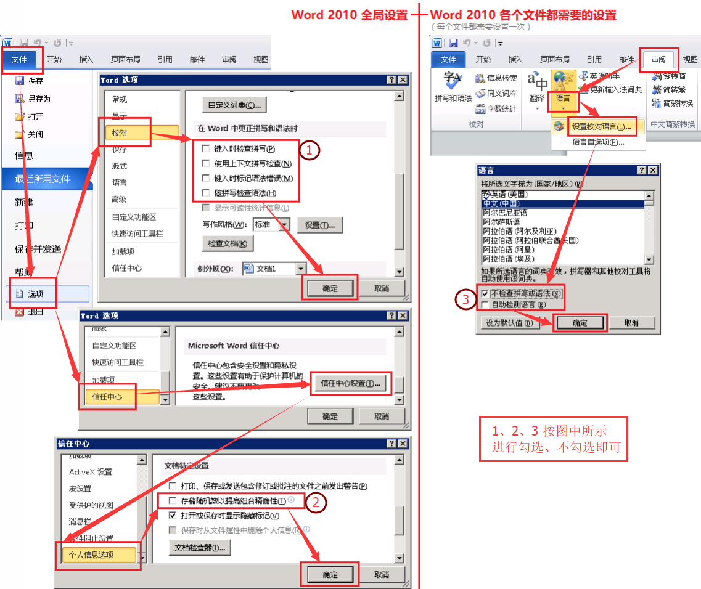
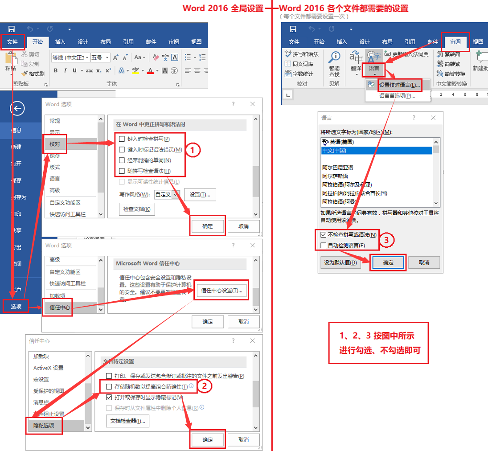

# Word 设置指引（BC系统Word模板文件需要此设置）

为了保证 Word 模板中的参数占位符 "${xxx}"、"<#if>...</#if>" 等在保存时不会被 Word 默认的格式配置打乱而导致模板失效，需要对 Word 软件进行相应的设置。
但复制粘贴为文本这个操作是不能少的。

> 历史：《[关于 Word 文档模板的制作](./2012-08-07-bc-关于Word文档模板的制作.md)》

## Word 2007 版：

无需额外的设置。

## Word 2010 版：

## Word 2016 版：

