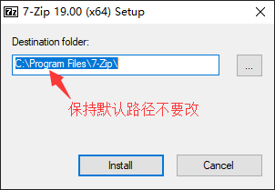
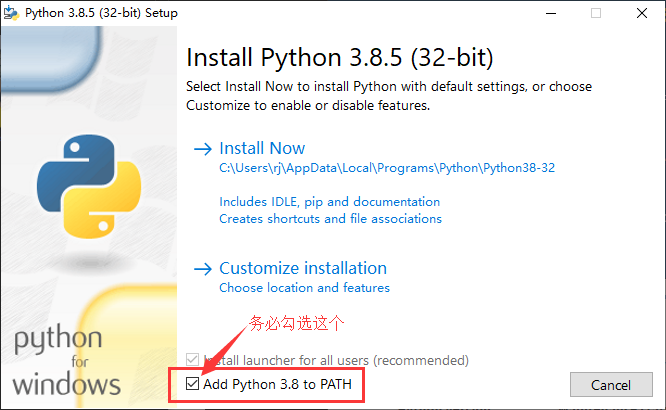
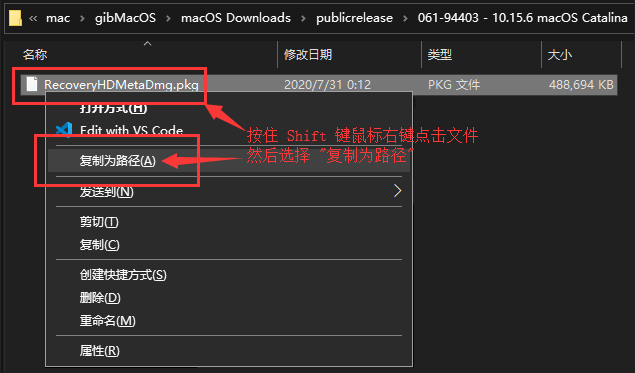

# 联想 M73 安装黑苹果

## 1. 安装 7-Zip

从官网下载 [7z1900-x64.exe](https://www.7-zip.org/a/7z1900-x64.exe) 文件，然后双击按默认路径安装。默认将安装到 `"C:\Program Files\7-Zip\"`。



> 不要安装到其它路径，因为试过更改为安装到其它路径，后续的 [gibMacOS] 会找不到。

### 2. 安装 Python

从官网下载 [python-3.8.5.exe](https://www.python.org/ftp/python/3.8.5/python-3.8.5.exe) 文件，然后双击安装，安装时特别注意要勾选安装界面底部的 "Add Python 3.8 to PATH"，否则后续的 [gibMacOS] 会找不到。



### 3. 下载 gibMacOS

在终端直接执行 `"git clone https://github.com/corpnewt/gibMacOS.git"` 下载到本地即可，由于作者没有对 gibMacOS 打 tag，当前时间（2020-08-03）最后提交的 ID 为 [commit-64f98e0](https://github.com/corpnewt/gibMacOS/commit/64f98e0c63e88e43075090ebe4b6a19a0cb6127b)。

> 如果没有 git 环境，也可以点 [这里](https://github.com/corpnewt/gibMacOS/archive/master.zip) 直接下载 zip 包后解压出来即可。

[gibMacOS] 目录结构为：

```
gibMacOS/
  ┝ Scripts/
  │  ┝ __init__.py
  │  ┝ BOOTICEx64.exe
  │  ┝ disk
  │  ┝ diskwin.py
  │  ┝ downloader.py
  │  ┝ plist.py
  │  ┝ run.py
  │  ┝ utils.py
  ┝ .gitignore
  ┝ BuildmacOSInstallApp.command
  ┝ gibMacOS.bat
  ┝ gibMacOS.command
  ┝ LICENSE
  ┝ MakeInstall.bat
  ┝ MakeInstall.py
  ┝ Readme.md
```

检查 Scripts 目录下是否有 `ddrelease64.exe` 文件，如果没有则需要自行下载并将其放到此目录下，否则后续 会因为找不到它而报错。下载地址：[下载1](http://www.chrysocome.net/downloads/ddrelease64.exe)、[下载2](https://github.com/corpnewt/gibMacOS/files/4573241/ddrelease64.exe.zip)。参考 [gibMacOS/issues/98](https://github.com/corpnewt/gibMacOS/issues/98)。

### 4. 使用 `gibMacOS.bat` 下载 MacOS 安装镜像

双击 `gibMacOS.bat`，将看到类似下面的选项：

2020-08-10:

```
#######################################################
#                Downloading Catalog                  #
#######################################################

Currently downloading publicrelease catalog from

https://swscan.apple.com/content/catalogs/others/index-10.15-10.14-10.13-10.12-10.11-10.10-10.9-mountainlion-lion-snowleopard-leopard.merged-1.sucatalog

Downloaded 2.10 MB of 6.62 MB (31.66%)

#######################################################
#                      gibMacOS                       #
#######################################################

Available Products:

1. macOS Catalina 10.15.6 (19G2006)
   - 001-36735 - Added 2020-08-06 23:39:24
2. macOS Catalina 10.15.6 (19G73)
   - 061-94403 - Added 2020-07-15 17:02:51
3. macOS Catalina 10.15.5 (19F2200)
   - 001-15219 - Added 2020-06-15 18:52:41
4. macOS Catalina 10.15.4 (19E2269)
   - 001-04366 - Added 2020-05-04 15:32:04
5. macOS Catalina 10.15.3 (19D2064)
   - 061-86291 - Added 2020-03-23 21:41:00
6. macOS Mojave 10.14.4 (18E2034)
   - 041-88800 - Added 2019-10-23 14:41:18
7. Install macOS High Sierra Beta 10.13.5 (17F66a)
   - 041-90855 - Added 2019-10-23 14:41:18
8. macOS High Sierra 10.13.6 (17G66)
   - 041-91758 - Added 2019-10-19 18:19:55
9. macOS Mojave 10.14.6 (18G103)
   - 061-26589 - Added 2019-10-14 20:51:08
10. macOS Mojave 10.14.5 (18F2059)
   - 061-26578 - Added 2019-10-14 20:38:26

M. Change Max-OS Version (Currently 10.15)
C. Change Catalog (Currently publicrelease)
I. Only Print URLs (Currently False)
R. Toggle Recovery-Only (Currently Off)
U. Show Catalog URL
Q. Quit

Please select an option: 9
#######################################################
#                Downloaded 11 of 11                  #
#######################################################

Succeeded:
  AppleDiagnostics.dmg
  RecoveryHDMetaDmg.pkg
  AppleDiagnostics.chunklist
  InstallESDDmg.pkg
  InstallAssistantAuto.pkg
  InstallESDDmg.chunklist
  InstallInfo.plist
  BaseSystem.dmg
  BaseSystem.chunklist
  OSInstall.mpkg
  MajorOSInfo.pkg

Failed:
  None

Files saved to:
  D:\tools\hackintosh\tools\gibMacOS\macOS Downloads\publicrelease\061-26589 - 10.14.6 macOS Mojave

Press [enter] to return...

#######################################################
#                Downloaded 11 of 11                  #
#######################################################

Succeeded:
  InstallAssistantAuto.pkg
  AppleDiagnostics.chunklist
  BaseSystem.dmg
  InstallESDDmg.pkg
  AppleDiagnostics.dmg
  OSInstall.mpkg
  BaseSystem.chunklist
  MajorOSInfo.pkg
  RecoveryHDMetaDmg.pkg
  InstallESDDmg.chunklist
  InstallInfo.plist

Failed:
  None

Files saved to:
  D:\tools\hackintosh\tools\gibMacOS\macOS Downloads\publicrelease\061-94403 - 10.15.6 macOS Catalina

Press [enter] to return...
```

```
Available Products:

1. macOS Catalina 10.15.6 (19G73)
   - 061-94403 - Added 2020-07-15 17:02:51
2. macOS Catalina 10.15.5 (19F2200)
   - 001-15219 - Added 2020-06-15 18:52:41
3. macOS Catalina 10.15.4 (19E2269)
   - 001-04366 - Added 2020-05-04 15:32:04
4. macOS Catalina 10.15.3 (19D2064)
   - 061-86291 - Added 2020-03-23 21:41:00
5. macOS Mojave 10.14.4 (18E2034)
   - 041-88800 - Added 2019-10-23 14:41:18
6. Install macOS High Sierra Beta 10.13.5 (17F66a)
   - 041-90855 - Added 2019-10-23 14:41:18
7. macOS High Sierra 10.13.6 (17G66)
   - 041-91758 - Added 2019-10-19 18:19:55
8. macOS Mojave 10.14.6 (18G103)
   - 061-26589 - Added 2019-10-14 20:51:08
9. macOS Mojave 10.14.5 (18F2059)
   - 061-26578 - Added 2019-10-14 20:38:26

M. Change Max-OS Version (Currently 10.15)
C. Change Catalog (Currently publicrelease)
I. Only Print URLs (Currently False)
R. Toggle Recovery-Only (Currently Off)
U. Show Catalog URL
Q. Quit

Please select an option:  R
```

输入 R 后回车：（选择这个可以极大的减少下载镜像的大小，因为后续下载的 MacOS 镜像是系统的恢复镜像，比原始的 MacOS 安装镜像少很多）

```
#######################################################
#                      gibMacOS                       #
#######################################################

Available Products:

1. Security Update 2020-004 10.14.6 (18G6020)
   - 001-26311 - Added 2020-07-15 17:10:16
2. Security Update 2020-004 10.13.6 (17G14019)
   - 001-08570 - Added 2020-07-15 17:07:31
3. macOS 10.15.6 Update 10.15.6 (19G73)
   - 061-94457 - Added 2020-07-15 17:02:52
4. macOS 10.15.6 Update 10.15.6 (19G73)
   - 061-94461 - Added 2020-07-15 17:02:52
5. macOS Catalina 10.15.6 (19G73)
   - 061-94403 - Added 2020-07-15 17:02:51 - FULL Install
6. macOS Catalina 10.15.5 (19F2200)
   - 001-15219 - Added 2020-06-15 18:52:41 - FULL Install
7. macOS Catalina 10.15.5 Supplemental Update 10.15.5 (19F2200)
   - 061-78585 - Added 2020-06-15 17:00:03
8. macOS Catalina 10.15.5 Update 10.15.5 (19F101)
   - 001-12341 - Added 2020-06-09 17:52:06
9. macOS Catalina 10.15.5 Update 10.15.5 (19F101)
   - 001-12343 - Added 2020-06-09 17:52:05
10. macOS Catalina 10.15.5 Supplemental Update 10.15.5 (19F101)
   - 001-12339 - Added 2020-06-01 17:23:54
11. Security Update 2020-002 10.14.6 (18G4032)
   - 061-90745 - Added 2020-05-26 22:52:14
12. macOS Catalina 10.15.4 (19E2269)
   - 001-04366 - Added 2020-05-04 15:32:04 - FULL Install
13. macOS Catalina 10.15.4 Update 10.15.4 (19E287)
   - 061-96008 - Added 2020-04-30 17:36:29
14. macOS Catalina 10.15.4 Update 10.15.4 (19E287)
   - 061-96003 - Added 2020-04-30 17:36:19
15. macOS Catalina 10.15.4 Supplemental Update 10.15.4 (19E287)
   - 061-96660 - Added 2020-04-08 21:12:36
16. macOS Catalina 10.15.3 (19D2064)
   - 061-86291 - Added 2020-03-23 21:41:00 - FULL Install
17. macOS Mojave 10.14.6 Supplemental Update 2 10.14.6 (18G103)
   - 061-41417 - Added 2019-10-24 18:25:52
18. macOS 10.14.6 Update 10.14.6 (18G103)
   - 061-41421 - Added 2019-10-24 18:24:51
19. macOS 10.14.6 Update 10.14.6 (18G103)
   - 061-41419 - Added 2019-10-24 18:22:50
20. MacBook Pro Supplemental Update 10.14.5 (18F203)
   - 041-88834 - Added 2019-10-23 17:12:57
21. macOS Mojave 10.14.4 (18E2034)
   - 041-88800 - Added 2019-10-23 14:41:18 - FULL Install
22. Install macOS High Sierra Beta 10.13.5 (17F66a)
   - 041-90855 - Added 2019-10-23 14:41:18 - FULL Install
23. macOS High Sierra 10.13.6 (17G66)
   - 041-91758 - Added 2019-10-19 18:19:55 - FULL Install
24. macOS 10.14.2 Update Combo 10.14.2 (18C54)
   - 041-88764 - Added 2019-10-15 20:19:46
25. macOS Mojave 10.14.6 (18G103)
   - 061-26589 - Added 2019-10-14 20:51:08 - FULL Install
26. macOS Mojave 10.14.5 (18F2059)
   - 061-26578 - Added 2019-10-14 20:38:26 - FULL Install
27. macOS 10.14.2 Update 10.14.2 (18C54)
   - 041-91742 - Added 2019-10-09 19:42:38

M. Change Max-OS Version (Currently 10.15)
C. Change Catalog (Currently publicrelease)
I. Only Print URLs (Currently False)
R. Toggle Recovery-Only (Currently On)
U. Show Catalog URL
Q. Quit

Please select an option: 5
```

这里选择了选项 5 ，安装最新版的 "macOS Catalina 10.15.6"，这里注意一定要选最后有 "FULL Install" 字样的版本。如上面选择的是：

```
5. macOS Catalina 10.15.6 (19G73)
   - 061-94403 - Added 2020-07-15 17:02:51 - FULL Install
```

输入选项回车后就会开始下载镜像，静静等待下载完毕即可：

```
#######################################################
#              Downloading File 1 of 1                #
#######################################################

Downloading RecoveryHDMetaDmg.pkg for 061-94403 - 10.15.6 macOS Catalina...

Downloaded 101.71 MB of 491.50 MB (20.69%)
```

下载完毕后界面会有相应提示，然后按回车键返回上一个界面，此时输入 Q 退出即完成。

[gibMacOS] 会将上面下载的 macOS Catalina 镜像缓存在如下位置：

```
gibMacOS/macOS Downloads/publicrelease/061-94403 - 10.15.6 macOS Catalina/RecoveryHDMetaDmg.pkg
```

### 5. 使用 `MakeInstall.bat` 将 OpenCore 和 MacOS 安装镜像写入 U 盘

将 U 盘插入，然后以管理员身份执行 `MakeInstall.bat`，将看到类似下面的选项：

```
#######################################################
#             Potential Removable Media               #
#######################################################

!WARNING!  This list includes both Removable AND
!WARNING!  Unknown disk types.  Be ABSOLUTELY sure
!WARNING!  before selecting a disk!

1. Kingston DataTraveler G3 USB Device - 16.04 GB (Removable)
   0. F: (BOOT) FAT32 - 205.52 MB

Q. Quit

Usage: [drive number][option (only one allowed)] r[Clover revision (optional)]
  (eg. 1B r5092)
  Options are as follows with precedence B > E > U > G:
    B = Only install the boot manager to the drive's first partition.
    O = Use OpenCore instead of Clover.
    E = Sets the type of the drive's first partition to EFI.
    U = Similar to E, but sets the type to Basic Data (useful for editing).
    G = Format as GPT (default is MBR).
    D = Used without a drive number, toggles showing all disks (currently DISABLED).

Please select a disk or press [enter] with no options to refresh: 1O
```

在上面的终端界面将会自动列出 U 盘列表，输入将要写入的 U 盘的编号 1（如果有多个移动磁盘或 U 盘插入将会看到多个，一定要选择正确的那个 U 盘的编号，选错了会擦掉里面所有的数据的），然后再输入字母 "O" 后回车：

```
#######################################################
#     Erase Kingston DataTraveler G3 USB Device       #
#######################################################

1. Kingston DataTraveler G3 USB Device - 16.04 GB (Removable)

If you continue - THIS DISK WILL BE ERASED
ALL DATA WILL BE LOST AND ALL PARTITIONS WILL
BE REMOVED!!!!!!!

Continue? (y/n):  y
```

输入 y 回车确认，会自动给 U 盘分区（分区格式为 MBR，共分了 2 个分区，首个分区大小约 200MB FAT32 格式并会自动加载，用于后续写入 OpenCore 的 EFI 引导程序，第二个分区用于后续写入 MacOS 镜像），分区完毕后出现如下界面：

```
#######################################################
#              Select Recovery Package                #
#######################################################

1. Kingston DataTraveler G3 USB Device - 16.04 GB (Removable)

M. Main Menu
Q. Quit

Please paste the recovery update pkg path to extract:
```

然后打开上面下载的 MacOS 镜像文件所在的目录，按住 Shift 键加鼠标右键点击镜像文件 `RecoveryHDMetaDmg.pkg`，然后选择 "复制为路径"：



然后在上面的 "Please paste the recovery update pkg path to extract:" 后面点击鼠标右键，将复制的路径粘贴在后面，结果类似为：

```
Please paste the recovery update pkg path to extract: "D:\tools\mac\gibMacOS\macOS Downloads\publicrelease\061-94403 - 10.15.6 macOS Catalina\RecoveryHDMetaDmg.pkg"
```

然后回车，镜像就会开始写入分好区的 U 盘内，静静等待完成即可：

```
#######################################################
#                Extracting Package                   #
#######################################################

Extracting Recovery dmg...
Extracting BaseSystem.dmg...
Extracting hfs...

#######################################################
#              Copying Image To Drive                 #
#######################################################

Image: C:\Users\rj\AppData\Local\Temp\tmpl81201g7\4.hfs

Disk 1. Kingston DataTraveler G3 USB Device - 16.04 GB (Removable)

D:\tools\mac\gibMacOS\Scripts\ddrelease64.exe if=C:\Users\rj\AppData\Local\Temp\tmpl81201g7\4.hfs of=\\?\Device\Harddisk1\Partition2 bs=8M --progress

This may take some time!
```

镜像写入完毕后会自动下载最新版的 OpenCore 然后自动解压并安装到 U 盘的 EFI 分区：

```
#######################################################
#                Installing OpenCore                  #
#######################################################

Gathering info...
 - Got OpenCore-0.5.9-RELEASE.zip
Downloading...
Downloaded 2.62 MB of 2.62 MB (100.00%)
Extracting OpenCore-0.5.9-RELEASE.zip...
Gathering DUET boot files...
 - boot
 - boot0
 - boot1f32
Copying EFI folder to F:/EFI...
Copying boot to F:/boot...
Updating the MBR with boot0...
Updating the PBR with boot1f32...
Cleaning up...

Done.

Press [enter] to return to the main menu...
```

完成后按回车键返回上一界面，然后输入 Q 推出即可。

> 这里要特别注意，如果没有使用代理，国内很可能下载 OpenCore 失败，导致前工尽废，需要重头再来。我是将代理软件的 "系统代理模式" 改为 "全局模式" 才成功的（"PAC 模式" 也失败了）。

2020-08-05 OpenCore 发布了 0.6.0 版，终端信息是这样的：

```
#######################################################
#                Installing OpenCore                  #
#######################################################

Gathering info...
 - Got OpenCore-0.6.0-RELEASE.zip
Downloading...
Downloaded 2.70 MB of 2.70 MB (100.00%)
Extracting OpenCore-0.6.0-RELEASE.zip...
Gathering DUET boot files...
 - boot
 - boot0
 - boot1f32
Copying EFI folder to F:/EFI...
Copying boot to F:/boot...
Updating the MBR with boot0...
Updating the PBR with boot1f32...
Cleaning up...

Done.

Press [enter] to return to the main menu...

2. 360 WiFi Flash Disk USB Device - 8.02 GB (Removable)
   0. F: (BOOT) FAT32 - 205.52 MB
   1. G: (No Name)  - Unknown
```

### 6. 修改 OpenCore 引导程序使其适合 M73

#### 6.1. SSDTs

<https://github.com/corpnewt/SSDTTime>

```
#######################################################
#                     SSDT Time                       #
#######################################################

Current DSDT:  None

1. FixHPET    - Patch out IRQ Conflicts
2. FakeEC     - OS-aware Fake EC
3. PluginType - Sets plugin-type = 1 on CPU0/PR00
4. Dump DSDT  - Automatically dump the system DSDT

D. Select DSDT or origin folder
Q. Quit

Please make a selection: 4
-----------------------------
Dumping DSDT table
Dump successful!
Moving DSDT to better location.
Success!
Press [enter] to return to main menu...

-----------------------------3
Determining CPU name scheme...
 - Could not locate CPU0 or PR00! Aborting!

Press [enter] to return to main menu...

-----------------------------2
Locating PNP0C09 devices...
 - None found - only needs a Fake EC device
Locating LPC(B)/SBRG...
 - Found SBRG
Creating SSDT-EC...
Compiling...

Done.

Press [enter] to return...
-----------------------------

```

#### x

```
#######################################################
#          Getting MacSerial Remote Version           #
#######################################################

Gathering latest macserial info...
```

上面如果不翻墙会卡死。

```
#######################################################
#                     GenSMBIOS                       #
#######################################################

MacSerial v2.1.1
Remote Version v2.1.2
Current plist: None
Plist type:    Unknown

1. Install/Update MacSerial
2. Select config.plist
3. Generate SMBIOS
4. Generate UUID
5. List Current SMBIOS

Q. Quit

Please select an option: 3

--------------------------------
#######################################################
#                  Generate SMBIOS                    #
#######################################################

M. Main Menu
Q. Quit

Please type the SMBIOS to gen and the number
of times to generate [max 20] (i.e. iMac18,3 5): iMac14,1 5
---------------------------------
#######################################################
#                iMac14,1 SMBIOS Info                 #
#######################################################

Type:         iMac14,1
Serial:       D25NJ3ZNFWJH
Board Serial: D25441501J9FM598C
SmUUID:       57FDB4F5-E609-4488-BB6E-43311A047B09

Press [enter] to return...
```

## OpenCore 资源

- Github [OpenCore/releases](https://github.com/acidanthera/OpenCorePkg/releases)
    - [Docs/Kexts.md](https://github.com/acidanthera/OpenCorePkg/blob/master/Docs/Kexts.md)
    - [What SSDTs do each platform need](https://dortania.github.io/Getting-Started-With-ACPI/ssdt-platform.html#desktop)
    - [OpenCore-Install-Guide](https://dortania.github.io/OpenCore-Install-Guide/config.plist/#selecting-your-platform)
- [github.com/acidanthera/OpenCorePkg](https://github.com/acidanthera/OpenCorePkg)
- [github.com/corpnewt](https://github.com/corpnewt): 
    - [ProperTree](https://github.com/corpnewt/ProperTree)
    - [SSDTTime](https://github.com/corpnewt/SSDTTime)
    - [GenSMBIOS](https://github.com/corpnewt/GenSMBIOS)
- []()


## 参考

- [OpenCore 官方在线文档](https://dortania.github.io/getting-started/)
- 2020-07-31 youtube/司波图 [90%人都够用的黑苹果小主机只要600块，附详细安装教程](https://www.youtube.com/watch?v=EN0pD_6pf8o&t=309s)
- 2020-07-05 [黑苹果 Hackintosh OpenCore 安装指南](https://www.cnblogs.com/yucloud/p/OpenCore.html)
    - 2020-07-14 [OpenCore的plist配置文件之 Haswell平台部分](https://www.cnblogs.com/yucloud/p/plist_haswell.html)

[gibMacOS]: https://github.com/corpnewt/gibMacOS
