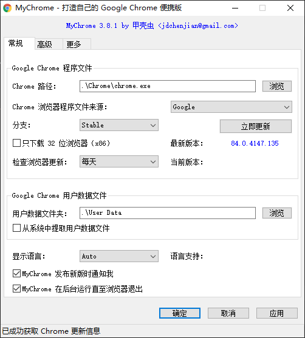
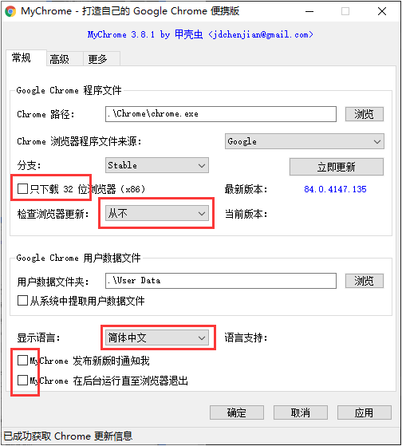
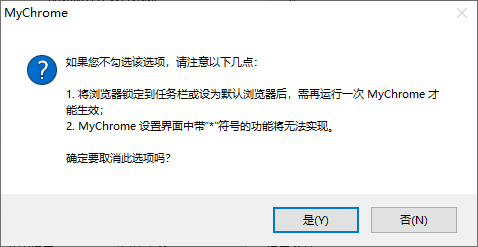
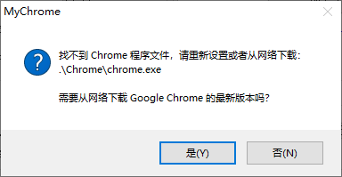
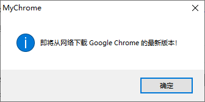
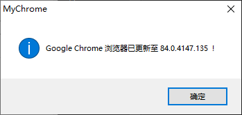
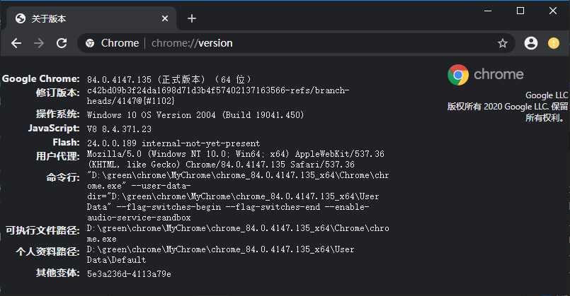

# 绿色版 Chrome 的制作

使用 MyChrome 制作，下载地址 <https://github.com/cnjackchen/my-chrome/releases>，如：

- 64 位版：<https://github.com/cnjackchen/my-chrome/releases/download/v3.8.1/MyChrome_v3.8.1.7z>
- 32 位版：<https://github.com/cnjackchen/my-chrome/releases/download/v3.8.1/MyChrome_v3.8.1_x64.7z>

## 步骤

### 1. 解压下载的 `MyChrome_v3.8.1.7z` 到某个目录

如：

```
D:\path-to\MyChrome\chrome_84.0.4147.135_x64\
  |-- MyChrome.exe
```

自行创建的目录 `chrome_84.0.4147.135_x64` 包含即将创建的绿色版的版本号 `84.0.4147.135` 和使用的平台 `x64`，主要是方便日后识别而已，可按需起其它名字，解压后该目录下只包含一个文件 `MyChrome.exe`。

### 2. 双击运行 `MyChrome.exe` 文件

打开后界面默认效果如下：



运行后，在当前目录会立即自动生成如下两个文件：

```shell
# 绿色版 Chrome 的配置文件
MyChrome.ini

# 用于替代本窗口的文件，因为制作完毕后，MyChrome.exe 就变成了启动绿色版 Chrome 的入口文件，要重新打开原始的配置窗口，改为运行此文件即可。
MyChrome.vbs
```

我制作 64 位版本，配置改为了如下：



当取消勾选 `"MyChrome 在后台运行直至浏览器退出"` 时，会看到如下警告提示窗口，直接点击 "是" 即可：



### 3. 开始制作绿色版 Chrome

点击界面右下角的 "应用" 按钮开始制作。

点击后，会弹出下载提示对话框，点击 "是" 继续即可：





下载完毕后（左下角会有下载进度提示），会自动解压并制作，看到如下对话框就证明制作完毕了：



制作完毕后，点击右上角直接关闭 MyChrome。此时目录结构应该如下：

```shell
D:\path-to\MyChrome\chrome_84.0.4147.135_x64\
  |-- Chrome/      # 包含 Chrome 主体程序的目录
  |-- User Data/   # 一个空白的目录，用于保存用户配置数据
  |-- MyChrome.exe # 启动绿色版 Chrome 的入口文件
  |-- MyChrome.ini # 绿色版 Chrome 的配置文件
  |-- MyChrome.vbs # 绿色版 Chrome 的配置窗口
```

> 制作完毕后，不要点击 "确认" 按钮，否则会自动打开刚创建的绿色版 Chrome，导致 "User Data" 目录下出现一堆本地首次使用的配置文件夹和文件。

### 4. 打包制作好的绿色版 Chrome

将整个目录 `chrome_84.0.4147.135_x64` 打包成压缩文件，如 `chrome_84.0.4147.135_x64.7z` 就可以备份或复制到其它电脑使用。

**使用时直接解压，然后双击 `MyChrome.exe` 文件即可打开绿色版 Chrome，无需安装。**

使用过程中在 Chrome 中更改的任何配置，包括收藏夹等，都会保存在 "User Data" 目录下，只要不是放在系统分区，就算系统分区格式化重装后，此绿色版的所有配置都会保留下来的，不会丢失用户配置数据。

### 5. 查看 Chrome 版本

打开 Chrome 后，在地址栏输入 `chrome://version`，就可以看到所制作版本的详细信息，如下图所示：


