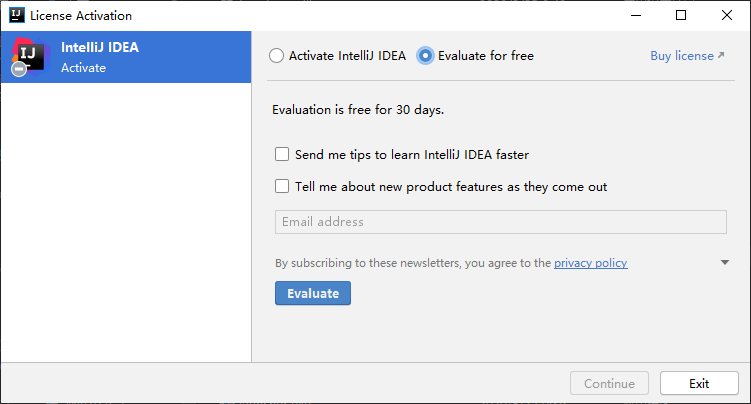
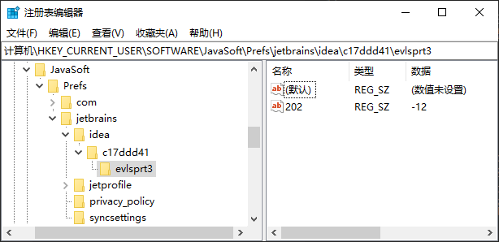

# IntelliJ IDEA Ultimate 试用期重置

[IntelliJ IDEA Ultimate](https://www.jetbrains.com/idea/download/other.html) 试用期为30天。如 9 月 3 日首次安装的版本，试用到期时间为 10 月 3 日：


试用期到期后可以通过如下方法重置，重新试用 30 天。

## IntelliJ IDEA Ultimate 2020 版

下面以 IntelliJ IDEA Ultimate 2020.2.x 版为例。按下面的方法重置试用期后，当重新打开 idea 时就会出现 "`License Activation`" 界面，选择 "`Evaluate for free`" 后，点击 "`Evaluate`" 按钮即可继续试用 30 天：



### 1. Windows 平台

#### 1.1. 删除试用密钥 `${idea.config.path}\eval\idea202.evaluation.key`

`idea202` 代表 2020.2.x 版。

`${idea.config.path}` 的默认值是 `%APPDATA%\JetBrains\IntelliJIdea2020.2\`。
> 如 `C:\Users\rj\AppData\Roaming\JetBrains\IntelliJIdea2020.2\`。  
> 如果通过 `idea.properties` 文件将 `${idea.config.path}` 修改为了其它路径，到指定的路径下删除相应的文件即可。


#### 1.2. 修改文件 `${idea.config.path}\options\other.xml`

删除 `other.xml` 文件内节点 `/application/component[name=PropertiesComponent]` 下属性名以前缀 `evlsprt` 开头的属性行，如：

```xml
<application>
  ...
  <component name="PropertiesComponent">
    ...
    <!-- 把如下这行删掉 -->
    <property name="evlsprt3.202" value="11" />
    ...
  </component>
</application>
```

#### 1.3. 删除注册表项 `HKEY_CURRENT_USER/Software/JavaSoft/Prefs/jetbrains/idea/${版本对应的8位码}/`

- `${版本对应的8位码}` 在首次打开 IDEA 时会自动生成，如 `c17ddd41`。
- 点击 `${版本对应的8位码}/evlsprt3` 节点可以核实一下对应的版本号，如 201 代表 2020.1.x 版、202 代表 2020.2.x 版。



### MacOS 平台

TODO

### Linux 平台

TODO

## 其它

[jetbrains-agent-latest](https://gitee.com/rj-hwang/jetbrains-agent-latest) 的作者编写了个重置脚本，可以拿来试试，不过还是推荐自己手工删除：

1. Windows 平台：[reset_jetbrains_eval_windows.vbs](https://gitee.com/rj-hwang/jetbrains-agent-latest/blob/rj/2020.1.3及以下/reset_eval/reset_jetbrains_eval_windows.vbs)
2. MacOS、Linux 平台：[reset_jetbrains_eval_mac_linux.sh](https://gitee.com/rj-hwang/jetbrains-agent-latest/blob/rj/2020.1.3及以下/reset_eval/reset_jetbrains_eval_mac_linux.sh)
